# 企业人事管理系统 (Enterprise HR Management System)

<div align="center">


**基于 Vue.js + Spring Boot 的现代化企业人事管理平台**

[在线演示](#) | [项目文档](#) | [问题反馈](#)

</div>

## 📋 目录

- [项目简介](#项目简介)
- [功能特性](#功能特性)
- [技术架构](#技术架构)
- [系统截图](#系统截图)
- [快速开始](#快速开始)
- [部署指南](#部署指南)
- [开发指南](#开发指南)
- [贡献指南](#贡献指南)
- [许可证](#许可证)

## 🎯 项目简介

企业人事管理系统是一个基于 **Vue.js** 和 **Spring Boot** 技术栈构建的现代化企业内部管理平台。系统采用前后端分离架构，提供完整的人事管理、资产申请、请假审批、财务记录、薪资管理等核心功能，支持多角色权限控制，旨在提升企业人事管理效率和信息化水平。

### 核心价值

- 🚀 **高效管理** - 简化人事管理流程，提升工作效率
- 🔐 **权限控制** - 基于角色的访问控制，保障数据安全
- 📊 **数据可视化** - 丰富的图表展示，直观了解企业状况
- 📱 **响应式设计** - 支持多端访问，移动端友好
- 🔄 **流程自动化** - 审批流程电子化，减少人工干预

## ✨ 功能特性

### 👥 用户管理
- **多角色支持** - 管理员、部门主管、普通员工
- **权限分级** - 基于角色的功能访问控制
- **个人信息管理** - 头像、密码、联系方式维护

### 🏢 部门管理
- **部门信息维护** - 部门名称、描述、主管设置
- **组织架构管理** - 部门层级关系维护
- **人员分配** - 员工部门归属管理

### 💰 薪资管理
- **薪资录入** - 员工薪资信息管理
- **薪资查询** - 多维度薪资数据查询
- **薪资统计** - 部门薪资分布分析

### 📋 请假管理
- **请假申请** - 员工在线提交请假申请
- **审批流程** - 主管审批 → 管理员审批
- **请假记录** - 个人请假历史查询
- **状态跟踪** - 实时查看审批进度

### 🏷️ 资产管理
- **资产信息** - 固定资产信息维护
- **资产申请** - 员工资产使用申请
- **审批管理** - 资产申请审批流程
- **库存管理** - 资产数量状态跟踪

### 💼 财务管理
- **支出记录** - 部门财务支出管理
- **支出统计** - 财务数据可视化分析
- **预算控制** - 部门支出预算管理

### 📢 公告管理
- **公告发布** - 系统公告信息发布
- **公告查询** - 历史公告信息查看
- **消息推送** - 重要信息及时通知

## 🏗️ 技术架构

### 前端技术栈

| 技术 | 版本 | 说明 |
|------|------|------|
| Vue.js | 2.6.14 | 渐进式JavaScript框架 |
| Element UI | 2.15.14 | 基于Vue的组件库 |
| Vue Router | 3.5.1 | 官方路由管理器 |
| Axios | 1.5.1 | HTTP客户端 |
| ECharts | 5.4.3 | 数据可视化图表库 |

### 后端技术栈

| 技术 | 版本 | 说明 |
|------|------|------|
| Spring Boot | 2.5.9 | 快速构建Spring应用 |
| MyBatis | 2.2.1 | 持久层框架 |
| MySQL | 5.7+ | 关系型数据库 |
| PageHelper | 1.4.6 | MyBatis分页插件 |
| Hutool | 5.8.18 | Java工具类库 |
| JWT | 4.3.0 | 身份认证令牌 |

### 系统架构图

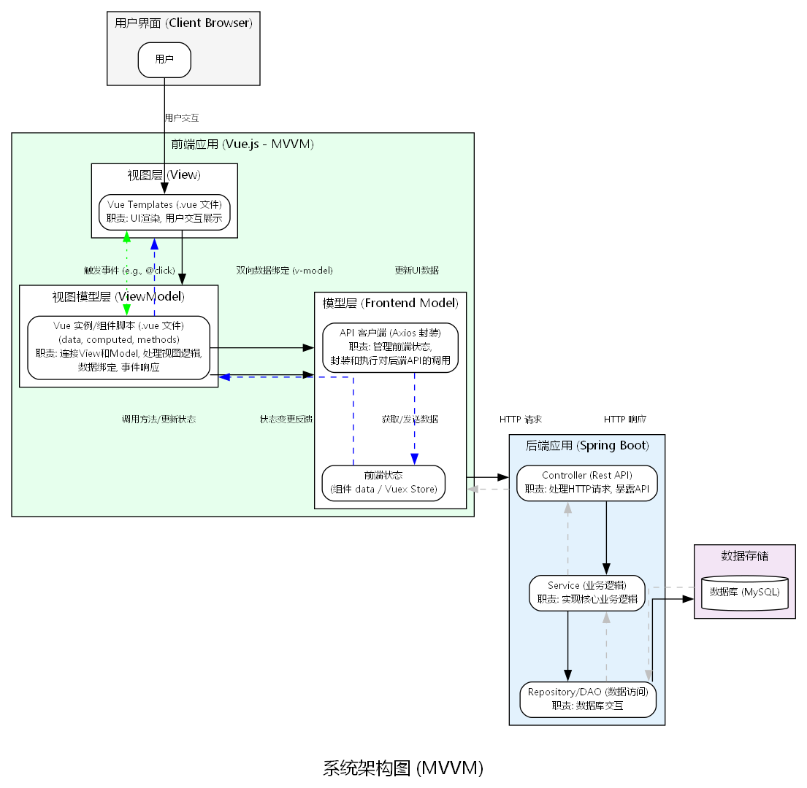

### 数据库设计

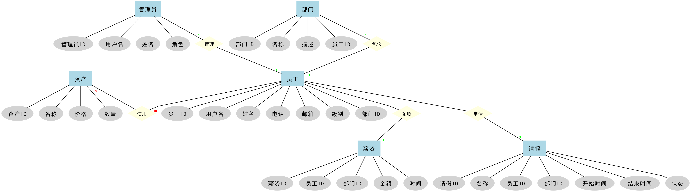

## 📸 系统截图

### 🖥️ 管理员界面

#### 系统首页
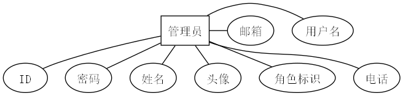

#### 公告管理
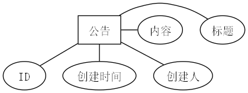

#### 员工管理
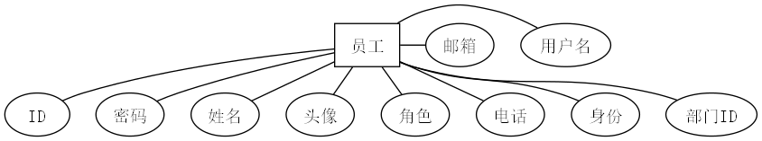

#### 部门管理
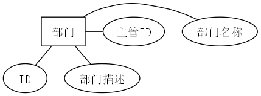

### 👨‍💼 主管界面

#### 请假审批
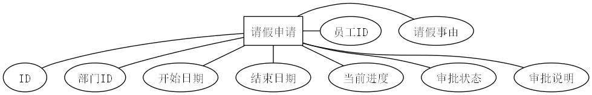

#### 资产审批
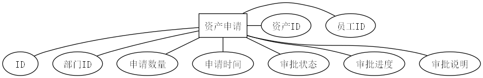

### 👤 员工界面

#### 薪资查询
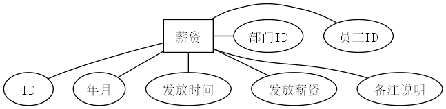

#### 资产申请
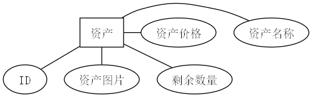

#### 财务支出
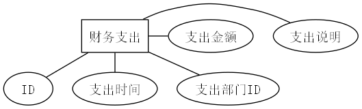

## 🚀 快速开始

### 环境要求

- **Java**: JDK 8+
- **Node.js**: 14.x+
- **MySQL**: 5.7+
- **Maven**: 3.x+

### 1. 克隆项目

```bash
git clone https://github.com/your-username/resources-manager.git
cd resources-manager
```

### 2. 数据库配置

```sql
-- 创建数据库
CREATE DATABASE xm_resources_manager DEFAULT CHARACTER SET utf8mb4 COLLATE utf8mb4_unicode_ci;

-- 导入数据
mysql -u root -p xm_resources_manager < resources_manager.sql
```

### 3. 后端启动

```bash
cd springboot

# 修改数据库配置
vim src/main/resources/application.yml

# 启动后端服务
mvn spring-boot:run
```

### 4. 前端启动

```bash
cd vue

# 安装依赖
npm install

# 启动开发服务器
npm run serve
```

### 5. 访问系统

- **前端地址**: http://localhost:8080
- **后端API**: http://localhost:9090

**默认账号**:
- 管理员: `admin` / `admin`
- 员工: `zhangsan` / `123456`

## 📦 部署指南

### 生产环境部署

#### 1. 后端部署

```bash
# 打包
mvn clean package -Dmaven.test.skip=true

# 运行
java -jar target/springboot-0.0.1-SNAPSHOT.jar
```

#### 2. 前端部署

```bash
# 构建生产版本
npm run build

# 部署到Web服务器
cp -r dist/* /var/www/html/
```

#### 3. Nginx配置

```nginx
server {
    listen 80;
    server_name your-domain.com;
    
    location / {
        root /var/www/html;
        index index.html;
        try_files $uri $uri/ /index.html;
    }
    
    location /api {
        proxy_pass http://localhost:9090;
        proxy_set_header Host $host;
        proxy_set_header X-Real-IP $remote_addr;
    }
}
```

## 🛠️ 开发指南

### 项目结构

```
resources-manager/
├── springboot/                 # 后端项目
│   ├── src/main/java/         # Java源码
│   ├── src/main/resources/    # 配置文件
│   └── pom.xml               # Maven配置
├── vue/                      # 前端项目
│   ├── src/                  # Vue源码
│   ├── public/               # 静态资源
│   └── package.json          # 依赖配置
├── 图表/                     # 系统截图
├── files/                    # 上传文件
└── resources_manager.sql     # 数据库脚本
```

### 开发规范

- **代码规范**: 遵循阿里巴巴Java开发手册
- **命名规范**: 使用驼峰命名法
- **注释规范**: 关键代码必须添加注释
- **提交规范**: 使用语义化提交信息

### API文档

后端API采用RESTful风格设计，主要接口包括：

- `GET /api/employee` - 获取员工列表
- `POST /api/employee` - 新增员工
- `PUT /api/employee/{id}` - 更新员工信息
- `DELETE /api/employee/{id}` - 删除员工

详细API文档请参考后端代码中的Controller类。

## 🤝 贡献指南

我们欢迎所有形式的贡献，包括但不限于：

- 🐛 Bug报告
- 💡 功能建议
- 📝 文档改进
- 🔧 代码贡献

### 贡献流程

1. Fork 本仓库
2. 创建特性分支 (`git checkout -b feature/AmazingFeature`)
3. 提交更改 (`git commit -m 'Add some AmazingFeature'`)
4. 推送到分支 (`git push origin feature/AmazingFeature`)
5. 创建 Pull Request

## 📄 许可证

本项目采用 [MIT](LICENSE) 许可证 - 查看 [LICENSE](LICENSE) 文件了解详情。

## 👨‍💻 作者

**Juice** - [undefinedx1n@outlook.com](mailto:undefinedx1n@outlook.com)

## 🙏 致谢

感谢以下开源项目：

- [Vue.js](https://vuejs.org/) - 渐进式JavaScript框架
- [Spring Boot](https://spring.io/projects/spring-boot) - 快速构建Spring应用
- [Element UI](https://element.eleme.io/) - 基于Vue的组件库
- [MyBatis](https://mybatis.org/) - 持久层框架

---

<div align="center">

**如果这个项目对您有帮助，请给个 ⭐️ 支持一下！**

Made with ❤️ by [Juice](mailto:undefinedx1n@outlook.com)

</div> 